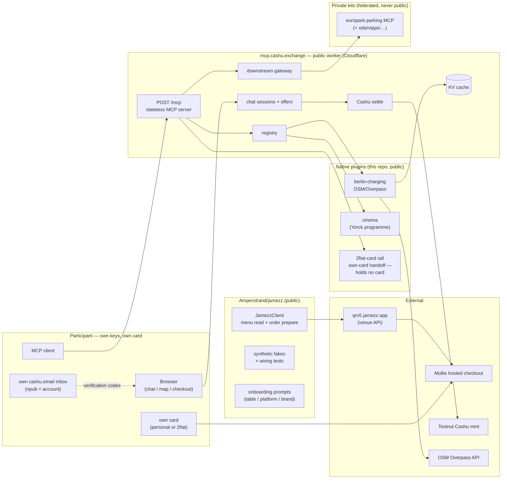

# mcp.cashu.exchange

A **modular MCP service exchange**: one registry, one gateway, and swappable
payment rails for payable services — EV charging, food, and more. Built as a
hackathon project (Berlin, 2026) to let AI agents *discover* and *pay for*
real-world services.

**Live:** <https://mcp.cashu.exchange> · MCP endpoint: `POST https://mcp.cashu.exchange/mcp`

| Route | What |
|---|---|
| `/` → `/demo` | redirects to the flagship chat demo at **chat.cashu.exchange** |
| `/berlin` | Berlin cinema box-office chat (Cashu-settled, Yorck programme) |
| `/map.html` | Leaflet map of Berlin EV chargers (OSM/Overpass, KV-cached) |
| `POST /mcp` | MCP server (streamable HTTP, stateless) |
| `GET /api/services` · `/api/charging` | JSON surfaces for the map/other clients |
| `GET /api/search?category=&text=&lat=&lng=&radiusKm=` | generic registry search — the REST twin of every `*.search` MCP tool |

**What is deployed right now, with verified example calls and a handover:**
[docs/LIVE.md](docs/LIVE.md).

## The idea

An *exchange*, not a monolith — and **one capability, many surfaces**: every
provider is reachable as an MCP tool (`<id>.search`), as REST
(`/api/search?category=…`), and as a plain library (the underlying package).
Clients pick their transport; the registry does not care.

Three moving pieces:

1. **Native plugins** (public, in this repo) — safe to open-source: OpenStreetMap
   data, checkout-handoff payment instructions, generic contracts.
2. **Federated downstreams** (private, yours) — existing MCP servers
   (`oda-mcp`, `vipps-mcp`, …) mounted through the gateway. Their code and
   personal data never enter this repo; only their URL + token (secrets).
3. **Payment rails** — interchangeable `PaymentRail` implementations:
   `2fiat-card` (own-card checkout handoff — no card ever touches this repo),
   Cashu (via [pecan](https://github.com/zeugmaster/pecan) for alternative
   numeraires), Lightning (stretch). See [docs/PAYMENT.md](docs/PAYMENT.md).

## Layout

```
packages/
  contracts/                The two contracts: ServiceProvider, PaymentRail
  core/                     Registry + MCP server + downstream gateway + catalog
  plugin-berlin-charging/   OSM/Overpass charging stations (native plugin)
  plugin-pay-2fiat/         Own-card checkout handoff rail (holds no card)
  map/                      Map frontend (placeholder: worker serves Leaflet page)
  chat/                     Chat frontend (placeholder: any MCP client works today)
apps/
  worker/                   Composition root → deploys to mcp.cashu.exchange
docs/
  PAYMENT.md                The own-card payment pattern (why no card lives here)
```

## Architecture



Payment boundary: **the hosted checkout URL**. The participant opens it and
pays with their own card; no card number ever enters a repo, secret, or tool
([docs/PAYMENT.md](docs/PAYMENT.md)). Venue identity flows the other way:
a table QR becomes a `JamezzClient` venue with zero credentials
([Amperstrand/jamezz](https://github.com/Amperstrand/jamezz)).

## Component status

| Component | Where | Status |
|---|---|---|
| Exchange worker (MCP + chat + map + JSON APIs) | `apps/worker` | deployed; CD blocked on `CLOUDFLARE_API_TOKEN` (issue #1) |
| Contracts (`ServiceProvider`, `PaymentRail`) | `packages/contracts` | done |
| Registry + gateway + catalog | `packages/core` | done |
| Berlin charging plugin (OSM/Overpass, KV-cached) | `packages/plugin-berlin-charging` | done |
| Cinema plugin (Yorck programme) | `packages/plugin-cinema` | works; hardcoded data policy = issue #3 |
| Own-card payment rail (card-free) | `packages/plugin-pay-2fiat` | done |
| Cashu settlement (chat offers → Testnut mint) | `apps/worker/src/cashu-settle.ts` | done |
| Jamezz client + prompts + offline tests | [Amperstrand/jamezz](https://github.com/Amperstrand/jamezz) | done (1 table mapped) |
| plugin-jamezz: venue tools on the exchange | `packages/plugin-jamezz` | done (live after next deploy) — discovery + menu preview; ordering deliberately stays in the jamezz package |
| Venue catalog growth (more QR mids) | jamezz `src/venues.ts` | 1 of ~18 Burgermeister locations; see its `docs/CANDIDATES.md` |
| Pecan (alternative-numeraire settlement) | catalog entry only | wiring not started |
| Lightning rail | — | stretch |
| jamezz npm publish | — | open decision |
| Leak gates + commit wrappers (both repos) | `scripts/` | done, enforced in CI |

## MCP tools

| Tool | What it does |
|---|---|
| `directory.list_services` | Catalog + native providers + payment rails |
| `gateway.list_downstreams` | Tools from federated downstream MCP servers (europark parking) |
| `berlin-charging.search` | EV chargers near a point (defaults: central Berlin) |
| `cinema.search` | Berlin cinema programme (category `shopping`) |
| `jamezz.search` | Jamezz table-ordering venues (category `food`): venue, PSP, live menu preview — ordering itself stays with the [jamezz](https://github.com/Amperstrand/jamezz) package and the merchant's hosted checkout |
| `payment.quote` | Payment instructions for an amount, per rail |

## Develop

```sh
npm install
npm test          # vitest
npm run typecheck # tsc --noEmit (strict)
npm run check     # biome
npm run dev       # wrangler dev on :8787
```

Copy `.dev.vars.example` → `.dev.vars` for local secrets (gitignored).

## Deploy

Continuous deployment on push to `main` (`.github/workflows/deploy.yml`) via
`wrangler`. Required repo **secrets** (never committed — this repo is public):

- `CLOUDFLARE_API_TOKEN` — scoped token: *Workers Scripts:Edit* +
  *Zone:Read* (+ DNS:Edit in the `cashu.exchange` zone for the custom domain)
- `CLOUDFLARE_ACCOUNT_ID`

Worker runtime secrets (`wrangler secret put`, per-name):

- `DOWNSTREAMS` — JSON array `[{"name":"oda-mcp","url":"https://…/mcp"}]`
  (plus a `TOKEN`-style secret per downstream if you extend the env parsing)

There are no card secrets, on purpose: participants pay with their own card
on the merchant's hosted checkout page. See [docs/PAYMENT.md](docs/PAYMENT.md).

## Hygiene rules (why this repo stays clean)

1. Secrets only via `wrangler secret` / `.dev.vars` (gitignored) / GitHub
   Actions secrets. Never in code, commits, or issues.
2. Fixtures are synthetic. No real names, PANs, cookies, or order histories.
3. Reverse-engineered API knowledge lives in private kits; this repo consumes
   them through the gateway. A plugin that needs personal data is a private
   kit implementing the same MCP surface — not a plugin here.
4. No tool returns card details — there is no `payment.card_details` and no
   card in any secret. The payment boundary is the merchant's hosted checkout
   URL, opened by the person paying (see [docs/PAYMENT.md](docs/PAYMENT.md)).

## Publication & leak policy

What may be public: contracts/types, synthetic fixtures (inline in tests, with
a provenance comment), architecture, infrastructure config that carries no
credential material.

What never enters this repo:

- **Card numbers, license plates, phone numbers, tokens, cookies, session
  captures** — in code, fixtures, docs, or comments.
- **Captured/sample payloads.** `**/fixtures/captures/`, `**/captures/`,
  `*.har`, `*.pcap` are gitignored. If a test needs a response shape, write a
  synthetic fixture and say so in a comment.
- **Reverse-engineered API knowledge stays in private kits** — this repo
  consumes it over MCP (the gateway), it does not vendor it.

Enforcement: `node scripts/leak-scan.mjs . --history` runs in CI on every PR
and push — PAN (Luhn-validated), Norwegian/German plates, phones, JWTs, Cashu
tokens, GitHub tokens, secret-shaped key/value pairs. Exceptions live in
`scripts/leak-scan-allowlist.txt` and **require a `# because:` justification**
line above each entry; unjustified entries fail the build.

## Adding a component

- **New provider** → new package implementing `ServiceProvider`, register it in
  `apps/worker/src/index.ts`. Tools appear automatically (`<id>.search`).
- **New rail** → implement `PaymentRail`, add to `exchangeDeps`.
- **Federate an existing MCP server** → append to `DOWNSTREAMS`. Done.

## License

MIT — see [LICENSE](LICENSE). Map data © OpenStreetMap contributors (ODbL).
